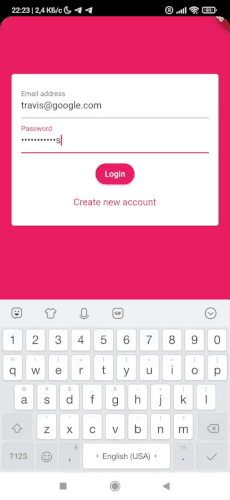
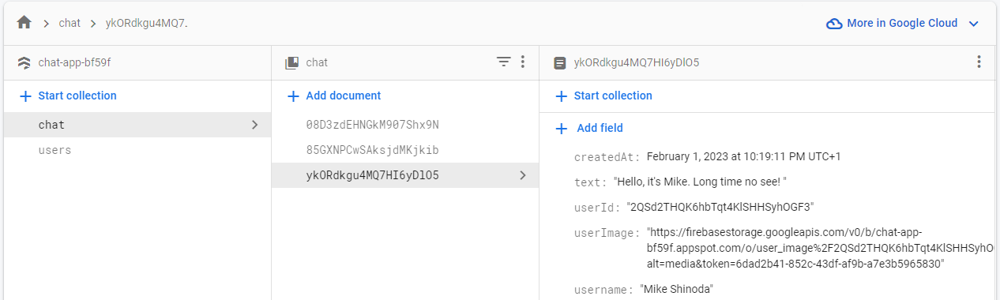

# Chat App

The app allows you to create a user with avatar, then log into the chat and send/receive messages.
___
## Technical description

Flutter 3.3.10 • Dart 2.18.6

Authentication and work with data are implemented using official Firebase plugins (aka Firebase SDK):
- `cloud_firestore 4.3.1`
- `firebase_core 2.4.1`
- `firebase_auth 4.2.4`
- `firebase_storage 11.0.10`
- `firebase_messaging 14.2.1`

This made it possible to work with such Firebase services as:
- Authentication
- Firestore database (for storing users and their messages)

- Storage (for storing users avatar images)
- Messaging (for notifications)

___
## Useful links
[Firebase integration](https://firebase.google.com/docs/flutter/setup?platform=ios)

___

*NOTE* since this project is a pet project, cases of overengineering are possible

